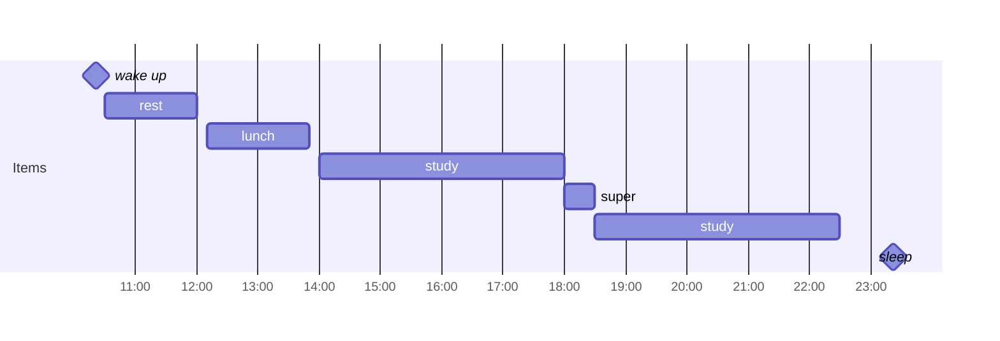

## Target

- [ ]

## Timeline

```mermaid
gantt
    dateFormat HH:mm
    axisFormat %H:%M
	section Items
    wake up : milestone, m1, 10:20, 2m
    rest : 10:30, 12:00
	lunch : 12:10, 13:50
	study : 14:00, 18:00
	super : 18:00, 18:30
	study : 18:30, 22:30
	sleep : milestone, m2, 23:20, 4m

	section Targets

```

## Thought

<<[[{{_lua:os.date("%Y-%m-%d", os.time() + (-1 * 24 * 60 * 60))_}}]] || [[{{_lua:os.date("%Y-%m-%d", os.time() + (1 * 24 * 60 * 60))_}}]]>>
